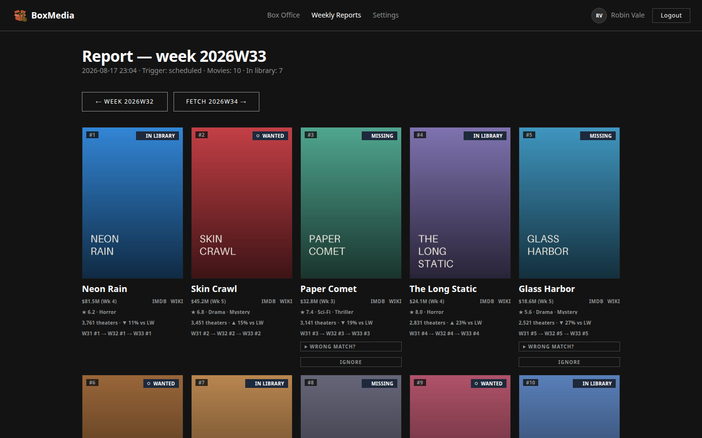
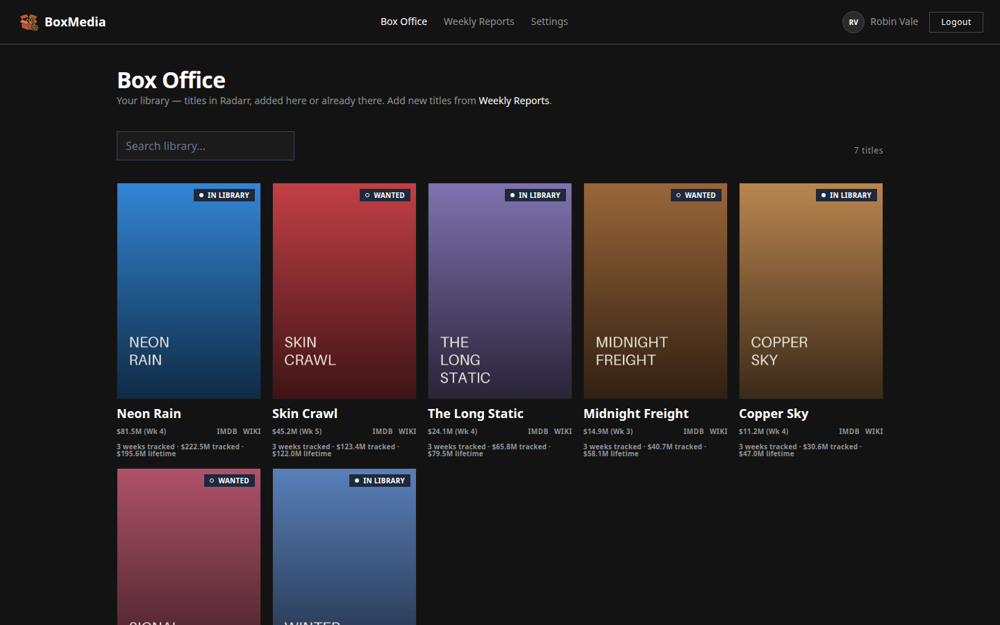
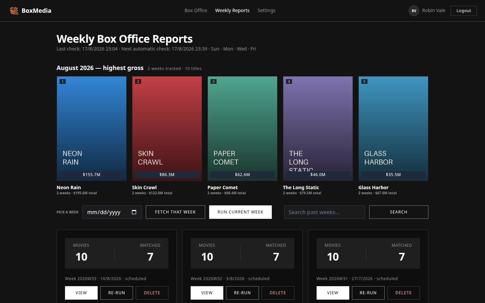
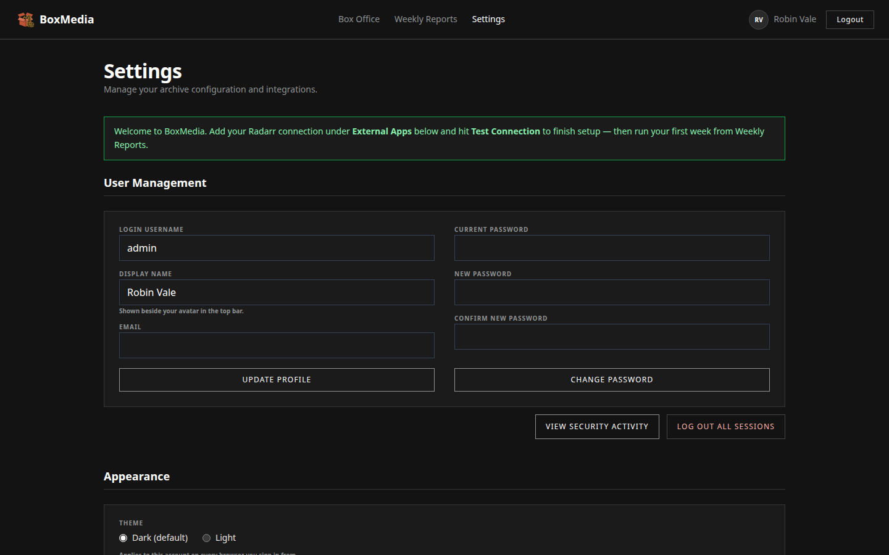

# BoxMedia

Self-hosted automation that surfaces **currently trending, commercially
successful films** for your home library. Each week it scrapes the Box Office
Mojo top‑10 and matches it against your Radarr library, then gives you a one‑click
review page to add the missing hits at the quality you choose — nothing is ever
sent to Radarr without you. It complements request-based tools (Overseerr and
friends): mainstream box-office hits are surfaced for review, while niche requests
still go through the normal workflow.

Single admin, dark "Obsidian" UI, runs behind a reverse proxy on a NAS or small
home server. It never downloads anything itself — it tells Radarr what to fetch.

## What it looks like

*All screenshots use fictional sample data.*

| | |
|---|---|
|  |  |
|  |  |

## Requirements & resource use

You need Docker with Compose and a reachable Radarr instance. The image is
published for **amd64 and arm64** — see [Supported platforms](#supported-platforms).

### Image

| | |
|---|---|
| Image | `ghcr.io/aiulian25/boxmedia` |
| On disk after pull | **165 MB** |
| Transferred over the network (compressed layers) | **39 MB** |
| Base | `gcr.io/distroless/python3-debian12:nonroot` |

The bulk is the Python runtime and dependencies (64 MB of site‑packages, 7 MB
interpreter); the application itself is ~1 MB and the stylesheet 57 KB.

### Runtime

Measured on a running v0.1.0 container with two Radarr connections and 13 stored
weeks. `docker compose` already caps the container at **1.0 CPU / 256 MB**.

| | measured | limit in compose |
|---|---|---|
| Memory, idle | **68 MiB** | 256 MiB |
| Memory, peak | **122 MiB** (at startup) | 256 MiB |
| CPU, idle | **0.8%** of one core | 1.0 core |
| Startup to serving | **1.6 s** | — |
| Processes + threads | 12 | — |

Memory is dominated by the Python interpreter and imports, not by the workload:
building a backup archive in memory — 7.2 MB of config, history, logs and cached
posters — did not move the peak at all. The weekly run parses one HTML page and
makes a handful of Radarr calls, so the busy path costs little more than idle.

Network use is negligible and mostly LAN: one chart page a week, a poster or
headshot on first sight of a title, and Radarr library calls on each page load.

### Disk

`/data` after 13 weekly runs:

| area | size | grows by |
|---|---|---|
| `config/` | < 1 MB | fixed — a few small YAML files |
| `history/` | 74 KB | ~6 KB per weekly report, capped at 50 reports |
| `logs/` | 0.6 MB | audit trail plus any saved scrape snapshots |
| `cache/` | 7.1 MB | ~14 KB per poster/headshot, only for titles you have seen |
| `backups/` | varies | one archive ≈ the four areas above (7 MB today) × how many you keep |

Backups dominate long‑term disk, and their retention setting bounds them: at the
default of 10 kept archives, roughly 70 MB today. Reports prune themselves to the
newest 50 at the end of every run, so `history/` plateaus on its own.

The poster cache is the one area with no automatic ceiling. Individual downloads
are capped at 5 MB, but the directory grows with every distinct title and cast
headshot you look at, and is only reclaimed when you press **Prune posters** under
Settings → Maintenance, which drops everything no retained report still shows. At
~14 KB a file that is slow growth, not a risk — but it is the number to watch on a
small disk, and it is why backups are worth their size: they carry the cache, so a
restore does not re-fetch hundreds of images.

### Recommended machine

| | CPU | RAM | Disk |
|---|---|---|---|
| Minimum | 1 core | 512 MB | 1 GB |
| Comfortable | 1–2 cores | 1 GB | 5 GB |

"Comfortable" leaves room for the OS, Docker itself, and a year of backups
without pruning. The app idles at well under 1% of one core, so it sits happily
on a box already running Radarr and a media server rather than needing its own.

### Supported platforms

| Platform | Covers |
|---|---|
| `linux/amd64` | PCs, mini‑PCs, servers, most NAS units (Synology/QNAP x86) |
| `linux/arm64` | Raspberry Pi 4/5, Apple‑silicon Docker hosts, ARM NAS units |

One image name serves both: the multi‑arch manifest hands Docker the right one
for your machine, so the pull command is identical everywhere. Needs Docker
Engine 20.10+ (any currently supported version) with Compose v2. 32‑bit ARM
(`armv7`, older Pis) is not published.

## Quick start (Docker Compose)

Grab [`docker-compose.yml`](docker-compose.yml) and [`.env.example`](.env.example)
into an empty folder, then:

```bash
# 1. Create your .env from the template and set BM_SESSION_SECRET.
cp .env.example .env
#    Generate a session secret:
docker run --rm --entrypoint /usr/bin/python3.11 ghcr.io/aiulian25/boxmedia:1.1.0 \
  -c "import secrets; print(secrets.token_urlsafe(48))"
#    Paste it into BM_SESSION_SECRET in .env.

# 2. Bring it up (pulls ghcr.io/aiulian25/boxmedia — no build step, ever).
docker compose up -d
```

The first `up` runs a one-shot `init` container that creates `./data` and
`./secrets`, hands them to the app's user, and generates your encryption key.
**Back that key up** — `./secrets/boxmedia.key` decrypts your stored Radarr API
keys and every backup archive, and nothing can recover them without it. See
[The encryption key](#the-encryption-key--read-this).

To keep the data somewhere else, set `BM_DATA_PATH` and `BM_SECRETS_PATH` in
`.env` — both services read them. Editing the volume lines in the compose file
instead means editing them twice, and `init` preparing one directory while the
app mounts another fails exactly like an unprepared install.

**Upgrading from 1.0.0 or 1.0.1?** Take the new `docker-compose.yml` rather than
amending your old one — the `init` service is what makes the rest of this work.
Your `.env`, data and key are unaffected.

Then point a reverse proxy (nginx/Traefik/Caddy/Pangolin/Cloudflare) at
`127.0.0.1:${BM_HOST_PORT}` (default `58546`) and terminate TLS there.

## First run

1. Read the one-time admin password from the logs:
   ```bash
   docker compose logs boxmedia | grep -A2 "temporary password"
   ```
2. Log in as `admin` and set a new password (required before anything else).
3. You'll land on **Settings** — add your Radarr connection (address + API key)
   and click **Test Connection**, then set your Radarr **defaults** (at minimum a
   quality profile and a default root folder) used when you add a title.
4. The weekly sync runs on its own to build a review report; hit **Run Now** to
   refresh it immediately. Titles are added to Radarr only when you click **Add**.

Configuration lives entirely in [`.env.example`](.env.example) (app-level
secrets/infra). Radarr connections are managed in the UI and encrypted at rest —
they never go in `.env`.

## Backups & disaster recovery

A backup is a **complete, encrypted snapshot of BoxMedia's state**: the admin
account, settings, encrypted Radarr connections, filters, the full weekly
report/chart history, audit logs, and the poster cache. A restore is
indistinguishable from the app never having been lost — you log in with your
previous password and find every report and setting exactly as before.

Media files are **never** in a backup. BoxMedia doesn't store them; your movie
library belongs to Radarr and its own storage. Archives are only a few MB.

Create, download, restore, or import backups under **Settings → Backups**, or let
one happen automatically before every restore (a safety net). Archives live in
`/data/backups/` as `boxmedia-<timestamp>-<id>.backup`; BoxMedia keeps the newest
10 and prunes the rest.

### 3‑2‑1 without extra software

The archives are AES‑256‑GCM encrypted, so they are safe to copy anywhere. Because
`/data/backups` sits on your host volume, whatever off-box sync you already run
picks them up for free — no cloud-upload feature to configure.

- **3 copies:** the live app data, the local backups in `/data/backups`, and one
  off-box copy.
- **2 media:** the NAS/Pi disk plus wherever you sync to.
- **1 offsite:** the synced copy.

**Syncthing** — share the `data/backups` folder to another machine or your VPS.

**rsync (cron)** — mirror the encrypted archives nightly:

```bash
# On the host, e.g. /etc/cron.daily/boxmedia-backup-sync
rsync -a --delete /srv/boxmedia/data/backups/ backup-host:/backups/boxmedia/
```

Because the archives are encrypted, the destination does not need to be trusted
storage.

### The encryption key — read this

Backups are encrypted with the key at `BM_ENCRYPTION_KEY_FILE`, which lives
**outside** `/data` by design — so a backup of the data directory can never
contain the key that decrypts it. The consequence:

- **To restore on a new machine you need BOTH the backup archive AND the key.**
- If you lose the key, your backups are unrecoverable. There is no recovery path.

So your 3‑2‑1 must include the key too — but stored **separately from the
archives**, or the whole point of keeping the key out of the backup is defeated:

- Keep the key in a password manager / secrets vault, **not** in the same folder
  or sync target as `/data/backups`.
- Back it up once when you create it; it rarely changes, so a single secure copy
  is enough.

### Rotating the encryption key

If the key is ever exposed, rotate it — this re-encrypts the stored Radarr API keys
under a new key. **Stop BoxMedia first:** a running instance holds the old key in
memory and would write old-key ciphertext back over the rotated file.

```bash
# 1. Stop the app.
docker compose down

# 2. Generate a new key next to the old one, then rotate the stored connections.
docker run --rm -v "$PWD/secrets:/secrets" --entrypoint /usr/bin/python3.11 \
  ghcr.io/aiulian25/boxmedia:1.1.0 -m app.core.crypto genkey /secrets/boxmedia-new.key
docker run --rm -v "$PWD/secrets:/secrets" -v "$PWD/data:/data" \
  --entrypoint /usr/bin/python3.11 ghcr.io/aiulian25/boxmedia:1.1.0 \
  -m app.core.crypto rotate /secrets/boxmedia.key /secrets/boxmedia-new.key /data

# 3. Point BM_ENCRYPTION_KEY_FILE (or the compose mount) at the new key, then start.
docker compose up -d
```

Nothing is written unless every key re-encrypts cleanly, so a failed rotation leaves
`apps.yml` untouched. **Keep the old key until every backup made with it is deleted** —
existing `.backup` archives can only be decrypted with the key they were created under.
Afterwards, verify with Settings → **Test Connection**.

### Restoring

- **From a stored backup:** Settings → Backups → **Restore** on the row.
- **From a file** (moving to a new host, or from your off-box copy): Settings →
  Backups → **Import a backup file**. The new host must have the **same encryption
  key** in place first. Corrupt, tampered, or wrong-key files are rejected safely;
  a validation failure never touches your live data.

## Security posture

- Argon2id password hashing; forced first-run password change; login
  rate-limiting with lockout.
- Radarr API keys AES‑256‑GCM encrypted at rest; backups encrypted with the key
  stored apart from the data.
- Strict CSP (`default-src 'self'`, no inline scripts/styles), HSTS behind TLS,
  same-origin enforcement + SameSite=Strict cookies, structured audit logging.
- Distroless runtime image: non-root (UID 65532), read-only root filesystem, all
  capabilities dropped, `no-new-privileges`, no shell or package manager, base
  images pinned by digest, dependencies hash-pinned.
- TLS certificate validation on all outbound Radarr calls; point `BM_TLS_CA_FILE`
  at a CA bundle for a self-signed home Radarr rather than disabling verification.

## Development

```bash
python3 -m venv .venv && .venv/bin/pip install -e ".[dev]"
.venv/bin/pytest                 # unit + integration tests
.venv/bin/ruff check app tests   # lint
# Recompile CSS after editing templates (Tailwind tree-shakes unused classes):
./tools/tailwindcss -c tailwind.config.js -i styles/tailwind.css -o app/static/css/app.css --minify
.venv/bin/uvicorn --factory app.main:create_app   # run locally
```

Pre-deploy gate: [`scripts/check.sh`](scripts/check.sh) runs ruff, pytest,
`pip-audit`, and a Trivy image scan.

## License

[MIT](LICENSE) — © 2026 aiulian25.
